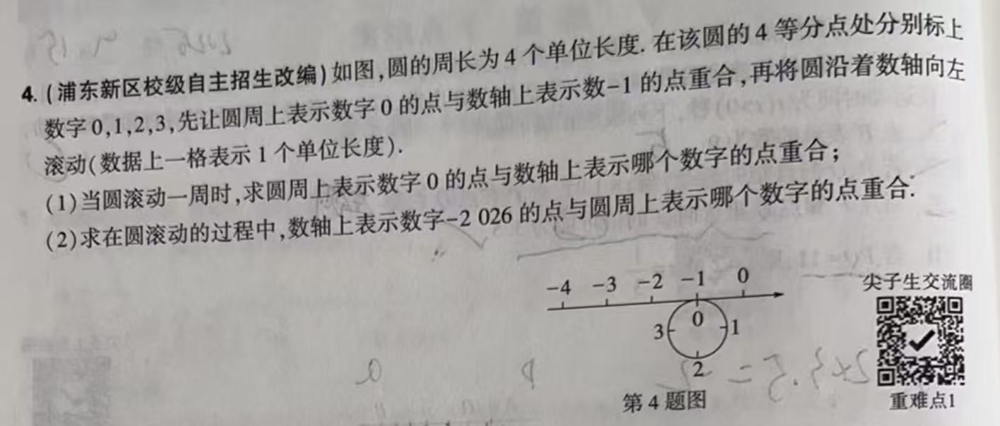

## debug

``` bash
windows系统文件夹进入wsl2中ubuntu
\\wsl.localhost\Ubuntu-24.04\home\nx\
```

## Install
>Our environment is cuda11.8+torch2.6.0.
1. Clone this repository and navigate to the DeepSeek-OCR folder
```bash
git clone https://github.com/fchsg/vllm_deep_ocr.git

cd ~/vllm_deep_ocr
git pull

```
2. Conda
```Shell
conda create -n deepseek-ocr python=3.12.9 -y
conda activate deepseek-ocr
```
3. Packages

- download the vllm-0.8.5 [whl](https://github.com/vllm-project/vllm/releases/tag/v0.8.5) 
```Shell
pip install pylatexenc
pip install pdf2image
pip install torch==2.6.0 torchvision==0.21.0 torchaudio==2.6.0 --index-url https://download.pytorch.org/whl/cu118
pip install vllm-0.8.5+cu118-cp38-abi3-manylinux1_x86_64.whl
pip install -r requirements.txt
pip install flash-attn==2.7.3 --no-build-isolation
```
## gradio
``` bash 
pip install gradio
python ~/vllm_deep_ocr/DeepSeek-OCR-master/Gradio/run_gradio.py

关闭gradio
执行：
lsof -i:2714
输出示例：
python3   12345 nx   3u  IPv4 1234567  0t0  TCP *:2714 (LISTEN)
然后执行：
kill -9 12345

```

## vLLM-Inference
- VLLM:
>**Note:** change the INPUT_PATH/OUTPUT_PATH and other settings in the vllm_deep_ocr/DeepSeek-OCR-vllm/config.py
```Shell
cd ~/vllm_deep_ocr/DeepSeek-OCR-master/DeepSeek-OCR-vllm
```
1. image: streaming output
```Shell
python run_dpsk_ocr_image.py
```
2. pdf: concurrency ~2500tokens/s(an A100-40G)
```Shell
python run_dpsk_ocr_pdf.py
```
3. batch eval for benchmarks
```Shell
python run_dpsk_ocr_eval_batch.py
```
## Transformers-Inference
- Transformers
```python
from transformers import AutoModel, AutoTokenizer
import torch
import os
os.environ["CUDA_VISIBLE_DEVICES"] = '0'
model_name = 'deepseek-ai/DeepSeek-OCR'

tokenizer = AutoTokenizer.from_pretrained(model_name, trust_remote_code=True)
model = AutoModel.from_pretrained(model_name, _attn_implementation='flash_attention_2', trust_remote_code=True, use_safetensors=True)
model = model.eval().cuda().to(torch.bfloat16)

# prompt = "<image>\nFree OCR. "
prompt = "<image>\n<|grounding|>Convert the document to markdown. "
image_file = 'your_image.jpg'
output_path = 'your/output/dir'

res = model.infer(tokenizer, prompt=prompt, image_file=image_file, output_path = output_path, base_size = 1024, image_size = 640, crop_mode=True, save_results = True, test_compress = True)
```
or you can
```Shell
cd vllm_deep_ocr/DeepSeek-OCR-hf
python run_dpsk_ocr.py
```
## Support-Modes
The current open-source model supports the following modes:
- Native resolution:
  - Tiny: 512×512 （64 vision tokens）✅
  - Small: 640×640 （100 vision tokens）✅
  - Base: 1024×1024 （256 vision tokens）✅
  - Large: 1280×1280 （400 vision tokens）✅
- Dynamic resolution
  - Gundam: n×640×640 + 1×1024×1024 ✅

## Examples


[test1.md](Test%2Fimage_ocr%2Fdeep_seek_ocr_output%2Ftest1%2Ftest1.md)


[test2.md](Test/image_ocr/deep_seek_ocr_output/test2/test2.md)
