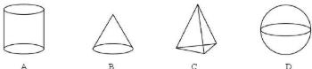
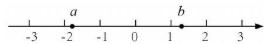
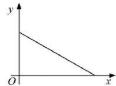

# 2022北京中考真题  

# 数学  

## 第一部分选择题  

## 一、选择题（共16分，每题2分）  

第1- 8题均有四个选项，符合题意的选项只有一个  

1. 下面几何体中，是圆锥的为  

  

2. 截至2021年12月31日，长江干流六座梯级水电站全年累计发电量达2628.83亿千瓦时，相当于减排二氧化碳约  

2.2亿吨。将262883000000用科学计数法表示应为  

A. 26.2883× 10^10 B. 2.62883× 10^11 C. 2.62883× 10^12 D. 0.262883× 10^12  

3. 如图，利用工具测量角，则 ∠ 1 的大小为  

A. 30^∘ B. 60^∘ C. 120^∘ D. 150^∘  

4. 实数 a ， b 在数轴上的对应点的位置如图所示，下列结论中正确的是  

  

A. a< -2 B. b< 1 C. a > b D. -a > b  

5. 不透明的袋子中装有红、绿小球各一个，除颜色外两个小球无其他差别，从中随机摸出一个小球，放回并摇匀，再从中随机摸出一个小球，那么第一次摸到红球、第二次摸到绿球的概率是  

A. 1/4 B. 1/3 C. 1/2 D. 3/4  

6. 若关于 x 的一元二次方程 x^2 + x + m = 0 有两个相等的实数根，则实数 m 的值为  

A. -4 B. -1 C. 1/4 D.4  

7. 图中的图形为轴对称图形，该图形的对称轴的条数为  

A.1 
B.2 
C.3 
D.5  

第7题图
  

第8题图
