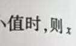

3. 若式子 | 3/4x - 1/4| + | 5/4x - 1/4| + | 7/4x - 1/4| + | 9/4x - 1/4| + | 11/4x - 1/4| + | 13/4x - 1/4| 的值取到最小值时,则 x 满足 ( ) 

满足 

A. 1/11≤ x ≤1/9 

C. 1/7≤ x ≤1/5 

B. 1/9≤ x ≤1/7 

D. 1/13≤ x ≤1/11 

 

 

尖子生交流圈